# Mobile App Development Assessment 4 - STEMM Lab

**Class:** LT6C (CSE3MAD)

**Members:**
- Ella Raputri (Binus Student ID 2702298154, LTU Student No. 23025379)
- Ellis Raputri (Binus Student ID 2702298116, LTU Student No. 23025362)

 

## Project Description
STEMM Lab is a mobile application that enables students to learn physics and medical knowledge through some activities provided in the app. Sensors, video, camera, and explanation of the students activity results are provided real time in the app. Besides that, each student can also view their team leaderboard in the app to see how accurate their results are compared to other teams. Hopefully, this STEMM Lab app can increase students motivation to learn science.

 

## Pages and Features

&ensp;<b>Login/Register Page</b>

- The Login/Register Page is the page for students to login or register their account.

- Features:
    - Sign in to existing account as students.
    - Sign up as a new student.
    - If the user choose Register, then they also need to create a new team or join an existing team because each student is required to have a team. 
    - The user can join a team by typing the team ID or scanning the team QR code from other members homepage.

- Here are some images of this page:

  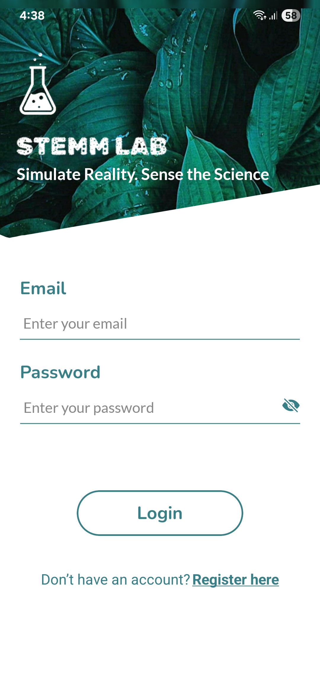 
  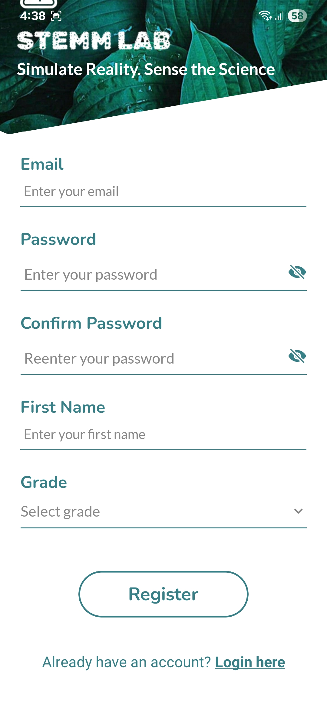 
  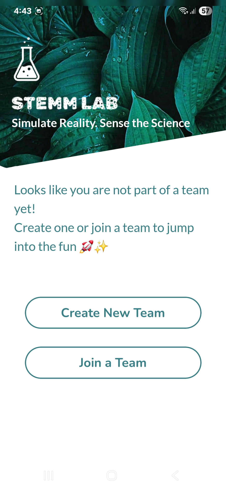 
 

 

&ensp;<b>Home Page</b>

- The Home Page is the landing page for student that is already logged in. 

- Features:
    - View details of the team they are in.
    - View the team performance (rank) across activities.

- Here are some images of this page:

  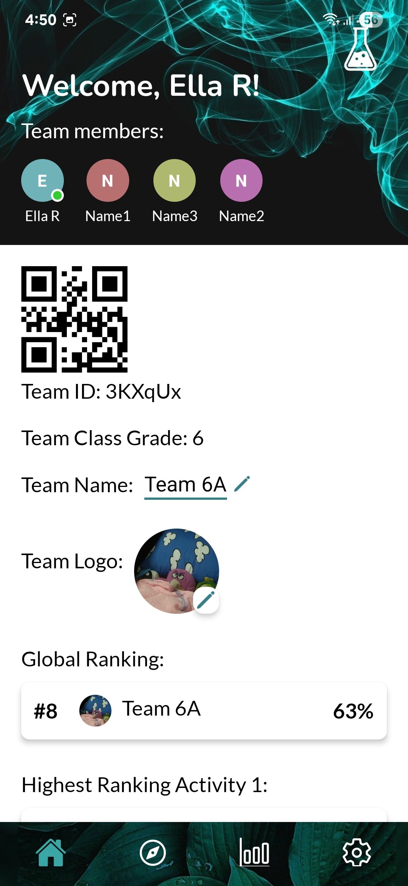 

 

 

&ensp;<b>Activity List Page</b>

- In the Activity List page, the student can view some activities that they can do in the STEMM Lab. 

- Features:
    - View the list of activity variants with their name and short description.
    - If the student clicks the activity card, then they will be redirected to the instruction page of the activity.

- Here are some images of this page:

  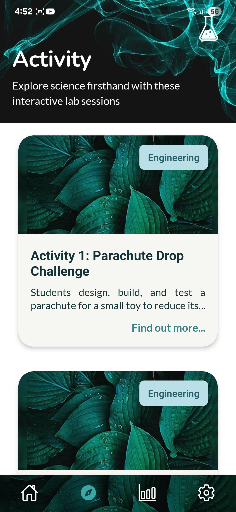 

 

 

&ensp;<b>Activity Instructions Page</b>

- In the Activity Instructions page, the student can view the instructions and general description of the activity.

- Feature: View the general description, equipments, instructions, and tutorial video of the corresponding activity.

- Here are some images of this page:

  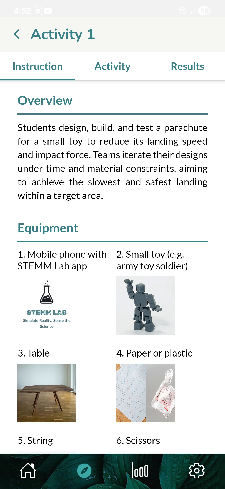 
  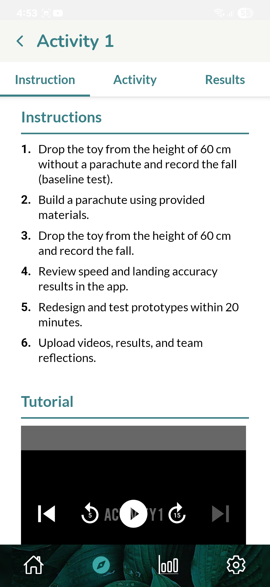 

 

 

&ensp;<b>Activity Main Page</b>

- This is the main page where user can record their submission (do the activity).
- Each activity has different main page due to the need of different type of submissions although some looked similar. 
- Activity 6 and 7 are different from activity 1 to 5 because they require all students in the team to be present to do the activity. Hence, the submission confirmation for both of them is slightly different.

- Features:
    - Record the submission of the activity.
    - View and edit the current submissions.
    - Submit the student's current activity result.

- Here are some images of the main recording page:

  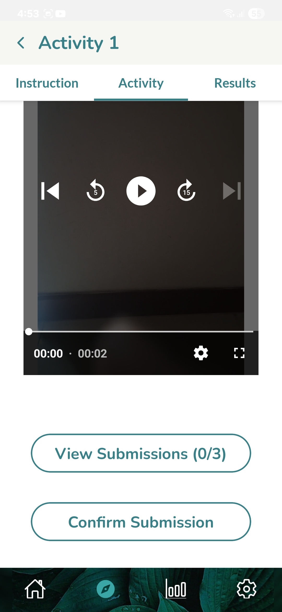 
  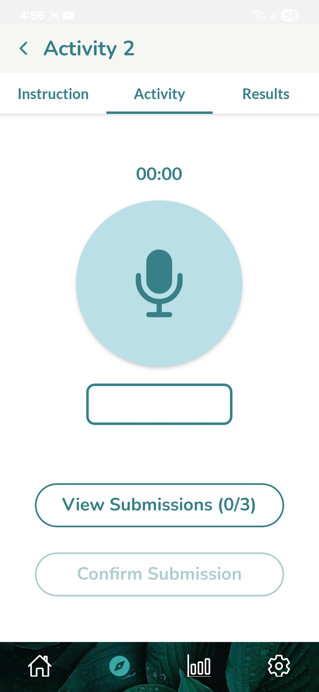 
  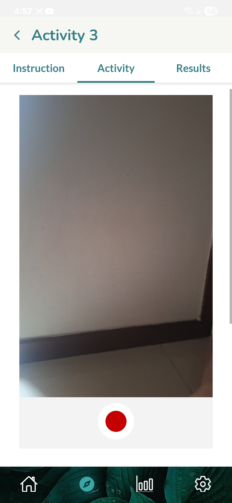 
  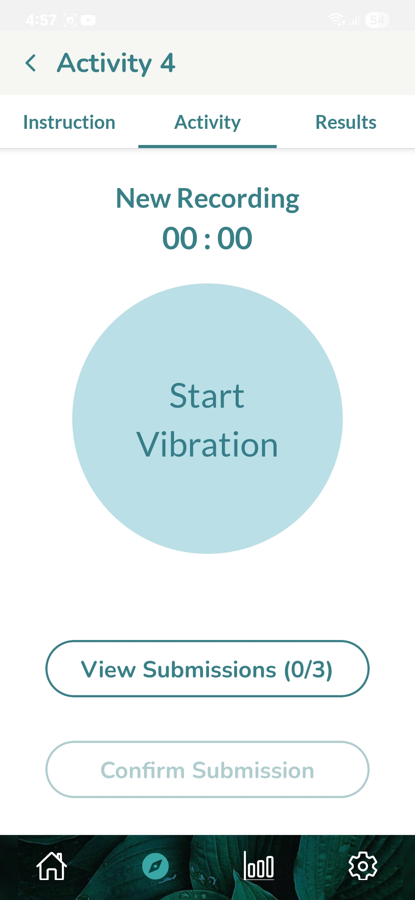 
   
  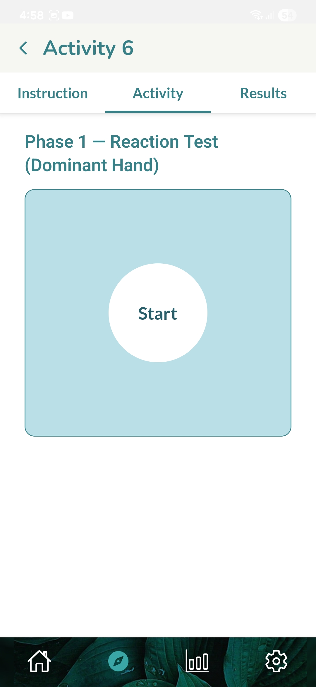 
  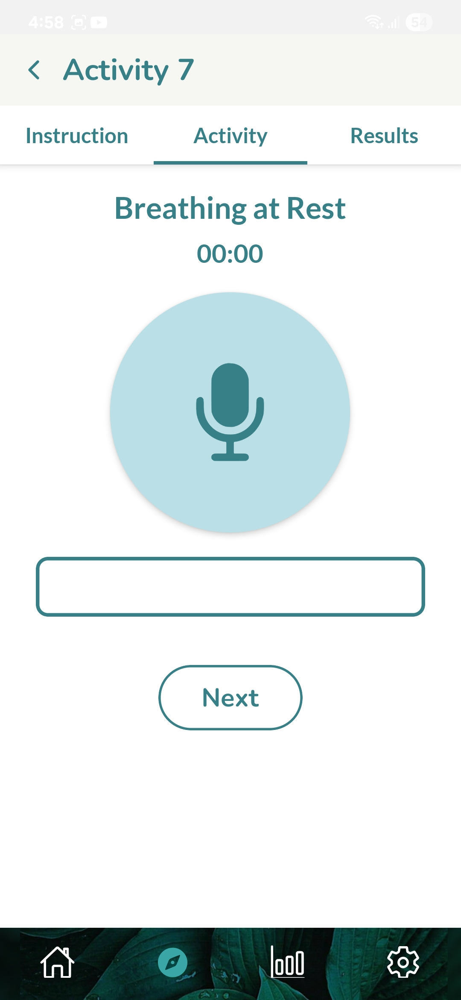 

- Here are some images of the submission confirmation page:

  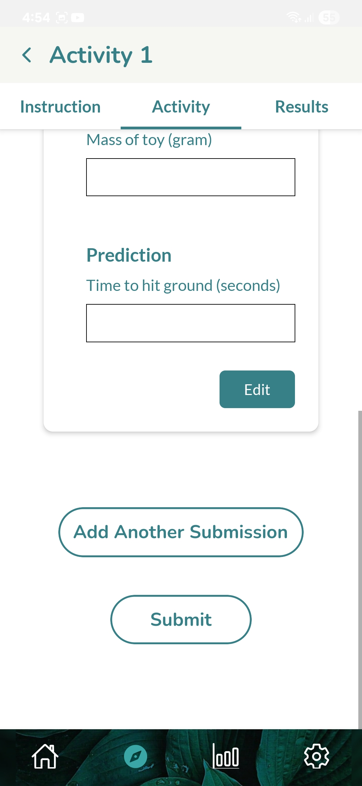 
  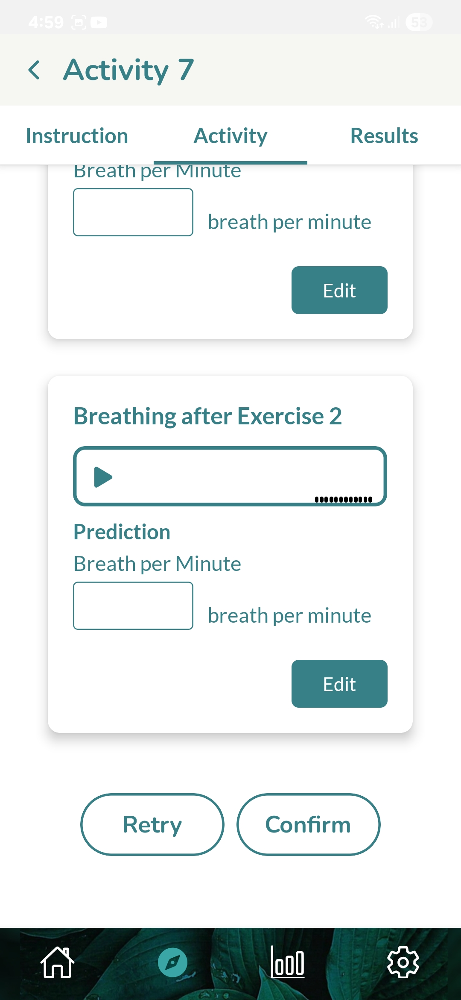 

 

 

&ensp;<b>Activity Results Page</b>

- This page contains information about the results (accuracy) of the student team predictions in the activity.

- Features:
    - View the list of attempts of the student team.
    - View the explanation and theory of each attempt submission.
    - View the rank of the attempt.
    - Rate the activity attempt.

- Here are some images of this page:

  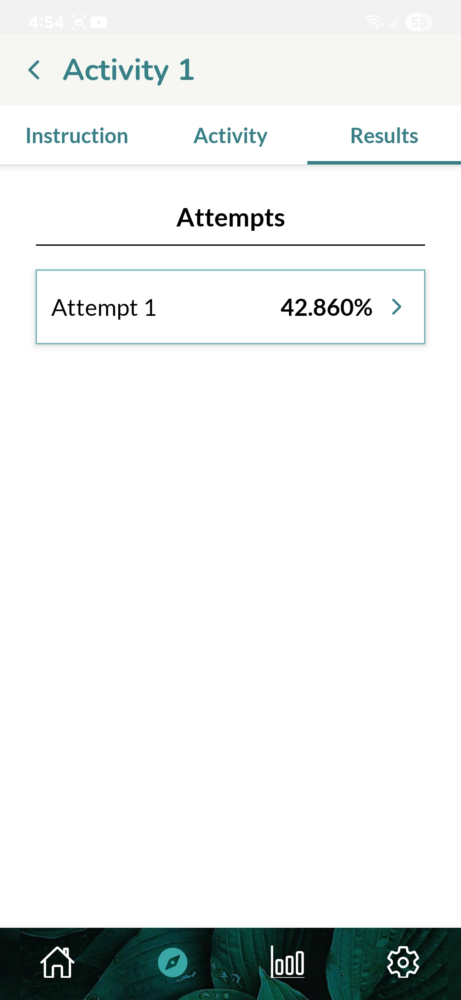 
  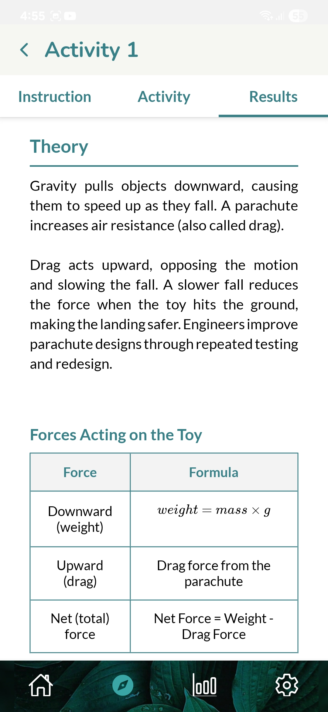 
  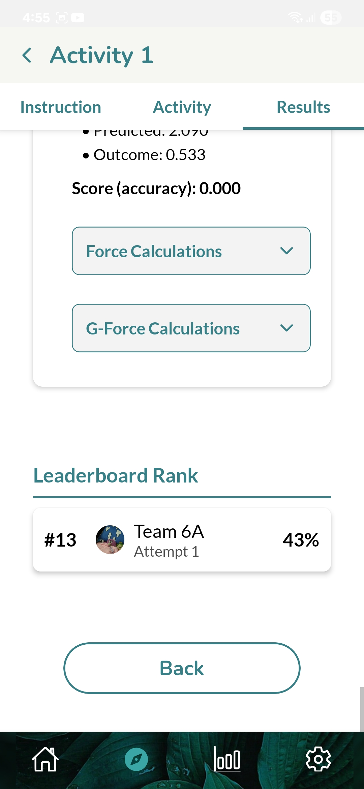 
  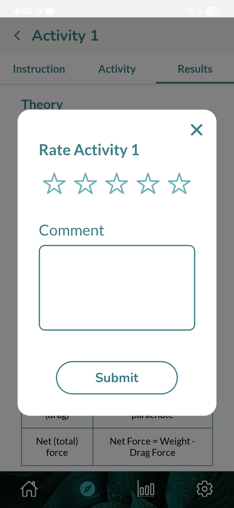 

 

 

&ensp;<b>Leaderboard Page</b>

- In the Leaderboard page, the student can view the rankings in the leaderboard for total score accumulation or for each activity. 

- Features:
    - View the top 10 rankings in the leaderboard.
    - View the team ranking (the best and latest attempt rankings).
    - Filter to view the ranking for global (total score for all activities) or for specific activity.

- Here are some images of this page:

   

 

 

&ensp;<b>Settings Page</b>

- This page contains app general information and settings for the student account.

- Features:
    - Edit the student's username and screen mode (light or dark).
    - View the terms and conditions.
    - Access the help centre for this app.

- Here are some images of this page:

  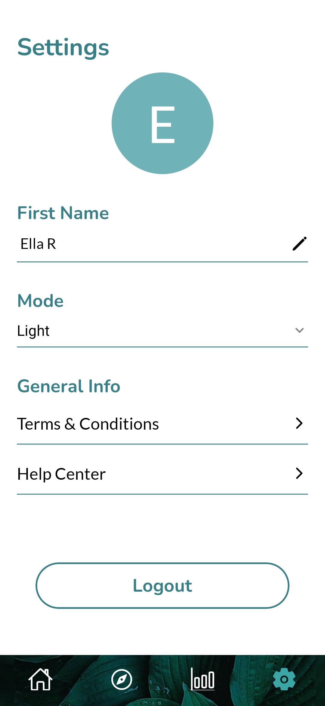 
  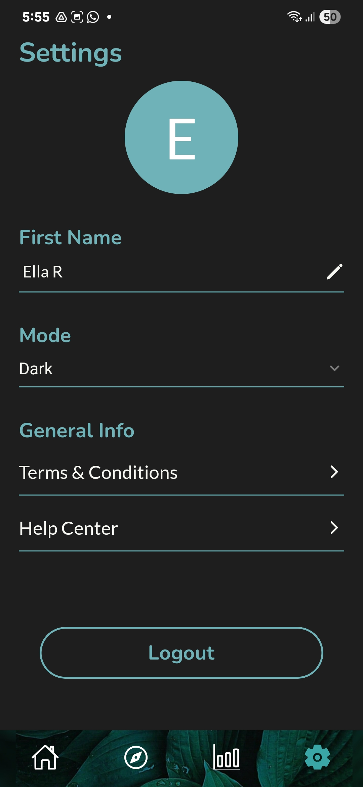 

 

 

 

## Contact Information

If you have any questions or feedback, please kindly contact us:
- Email: ellarworkingfolder@gmail.com